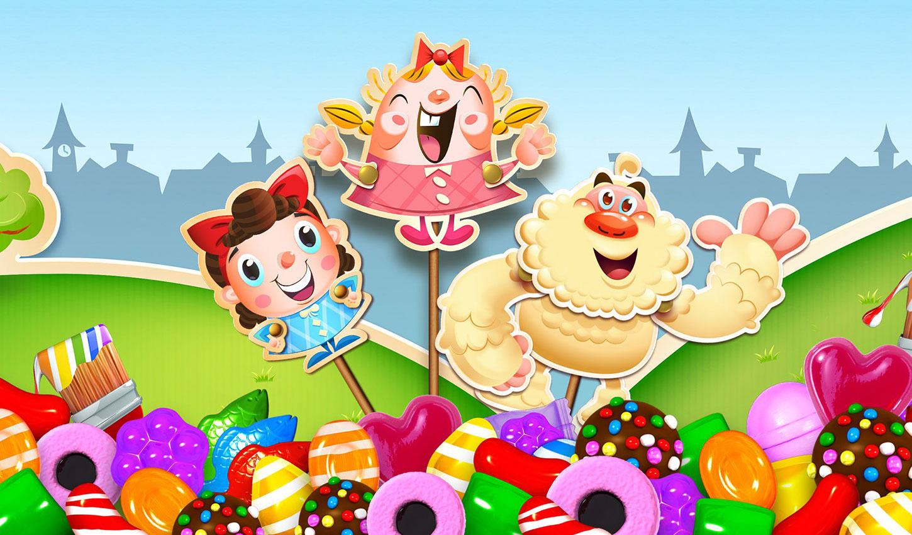
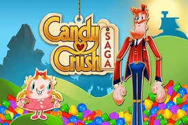

<head>
	<meta charset="utf-8" />
	<link rel="stylesheet" type="text/css" href="estilof.css">   
</head>
<body>
	

		

			<header>
				

					<h1 class="logo">Candy Crush Saga</h1>
				

				

					 
				<nav>
				<ul class="menu inline sem-marcador">
					<li><a href="https://community.king.com">Site oficial</a></li>
					<li><a href="https://www.techtudo.com.br/listas/2017/11/candy-crush-saga-confira-10-curiosidades-sobre-o-game.ghtml">Curiosidades</a></li>
					<li><a href="https://community.king.com/en/candy-crush-saga/discussion/220167/is-there-a-world-rank-listing-for-candy-crush-saga">Ranking</a></li>
				    <li><a href="https://king.com/pt_BR/game/candycrush">Jogue Agora</a></li>
       	        </ul>   
      				</nav> 
			

		</header>
	

 
		<section>
			

				<h3>Saiba tudo sobre o mundo de Candy Crush</h3>
				<ul class="sem-marcador sem-padding">
					<li><a href="https://pt-br.facebook.com/CandyCrushBrasil/">Fanpage</a></li>
					<li><a href="http://procrastination.com.br/games/candy-crush-70-dos-jogadores-nunca-pagaram-extras">Perfil dos jogadores</a></li>
					<li><a href="https://www.youtube.com/watch?v=d5Rf0An-jEg">Game Play</a></li>
					<li><a href="https://www.bbc.com/portuguese/noticias/2015/11/151103_candy_crush_mdb">Notícias</a></li>
					<li><a href="https://www.tecmundo.com.br/smartphone/118316-reis-smartphone-candy-crush-clash-of-clans-preferidos-no-brasil.htm">Jogos Preferidos</a></li>
				</ul>
				<a href="https://play.google.com/store/apps/details?id=com.king.candycrushsodasaga&hl=pt_BR" class="botao">Baixar no Android &raquo;</a>
			

			

				<h2>Sobre o jogo</h2>
				
				
 Candy Crush Saga é um jogo de puzzle lançado pela King em 12 de abril de 2012 para Facebook, em 6 de setembro de 2012 para Windows Phone, em 14 de novembro de 2012 para iOS, em 14 de dezembro de 2012 para Android, em 11 de setembro de 2014 para Fire OS e em 29 de julho de 2015 para Windows 10 e Tizen.

				<a href="https://pt.wikipedia.org/wiki/Candy_Crush_Saga" class="botao">Veja mais &raquo;</a>
				

			</section>
		

		

			

				

		<section>
		<h2><b>Pontuação</b></h2>
		
De acordo com o agregador de avaliações Metacritic, o jogo recebeu uma pontuação média de 79/100, indicando críticas positivas.Ellie Gibson da Eurogamer se refere à Candy Crush Saga como "Jogo do Ano" de 2013.
		

			<b>Comercial</b> 
			
Candy Crush Saga teve mais de dez milhões de downloads em dezembro de 2012.Em julho de 2013, estimou-se que Candy Crush Saga na época tinha cerca de 6,7 milhões de usuários ativos e obteve uma receita de 633 000 de dólares por dia na seção dos americana do iOS App Store sozinho.De acordo com o Business Insider, Candy Crush Saga foi o aplicativo mais baixado do iOS em 2013.Em 2014, jogadores de Candy Crush Saga gastaram mais de 1,33 bilhões de dólares em compras dentro do aplicativo, que foi um declínio em relação ao ano anterior, uma vez que somente no segundo semestre de 2013, os jogadores gastaram mais de 1,04 bilhões de dólares.Em 2 de novembro de 2016 a Activision adquiriu a King (empresa produtora do jogo) por USD 5.9 bilhões sendo assim uma das maiores aquisições do ano.
 
</body>
</html>
